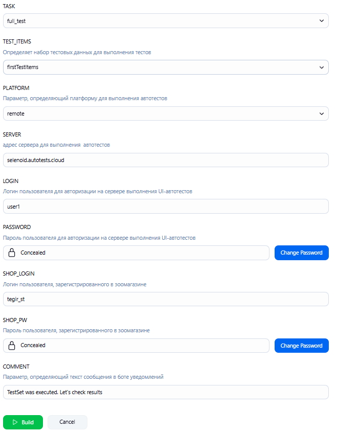

# 
Дипломный проект 

## 
UI-часть на примере сайта интернет магазина товаров для животных [Kakadu](http://kakadu39.ru/)

# Содержание
- [Стек технологий](#стек-технологий)
- [Список тестов](#список-тестов)
- [Jenkins](#jenkins)
- [Запуск автотестов](#запуск-автотестов)
- [Allure-отчет](#allure-отчеты)
- [Уведомления в телеграм](#уведомления-в-телеграм)
- [Пример запуска автотестов](#примеры-запуска-автотестов)

## Стек технологий

  

Автотесты в проекте написаны на <code>Java</code> с использованием фреймворка [Selenide](https://selenide.org/),  
сборщик - <code>Gradle</code>,  
фреймворк модульного тестирования - <code>JUnit 5</code>,  
удаленный запуск браузера и прохождение сценариев - [Selenoid](https://aerokube.com/selenoid/),  
управление удаленным запуском, настройка параметров и формирование отчета - <code>Jenkins + Allure</code>.  
Реализована отправка результатов в <code>Telegram</code> при помощи бота.

### Список тестов
**fullFilledApplicationForPartnershipShouldDisplaySuccessMessageTest** - Тест отправки заявки для сотрудничества  
**partFilledApplicationForPartnershipShouldDisplayErrorMessageTest** - Тест ошибки при неполном заполнении формы  
**vacanciesListShouldContainRelevantItemsOrBeEmptyTest** - Тест фильтра вакансий по специальности  
**fullFilledRequestCallbackFormShouldDisplaySuccessMessageTest** - Тест формы заказа обратного звонка  
**contactsPageShouldContainAllLocationsTest** - Тест отображения локаций офисов

### Jenkins
Настройка, запуск и переход к результатам запуска автотестов осуществляется в [Jenkins](https://jenkins.autotests.cloud/job/006-ilya_krestsov_qa_guru_javaAQA_diplom/)

### Запуск автотестов
Автотесты запускаются сборкой в <code>Jenkins</code> с заполнением параметров выполнения

  

- **EXEC_SERVER** - Адрес сервера выполнения тестов
- **CREDENTIALS_LOGIN** - Логин для доступа к серверу выполнения тестов
- **CREDENTIALS_PW** - пароль для доступа к серверу выполнения тестов
- **BROWSER, BROWSER_VERSION, BROWSER_SIZE** - Выбор браузера/версии/разрешения экрана для исполнения тестов
- **COMMENT** - Параметр, определяющий текст сообщения в боте уведомлений

### Allure-отчеты

Allure-отчет содержит в себе результаты выполнения всех тестов с дополнительной информацией:
- Скриншот финала теста
- код страницы
- журнал консоли браузера при выполнении теста
- [видео-запись выполнения теста](https://selenoid.autotests.cloud/video/f6f6c0e7f7576427a76354f107f99edd.mp4)

[Пример полного allure-отчета](https://jenkins.autotests.cloud/job/CenticoreJobApplication/allure/)

### Уведомления в телеграм

По завершении выполнения тестов отправляется краткий отчет в телеграм-бот со ссылкой на полный allure-отчет

 

### Примеры запуска автотестов

  

